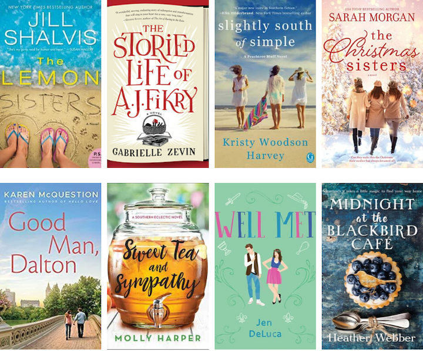
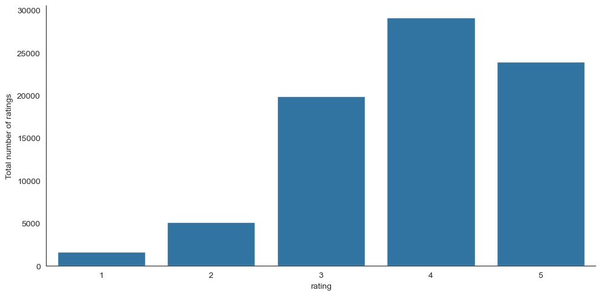

# **Book Recommendation System: Content-Based & Collaborative Filtering**  



## **INTRODUCTION**  
With millions of books available, selecting the right one can be overwhelming. This project builds a **hybrid book recommendation system** using both:  
- **Content-Based Filtering**: Recommends books based on their descriptions and metadata.  
- **Collaborative Filtering**: Recommends books based on user interactions and ratings.  

The dataset used is **Goodbooks-10k**, containing information about books, ratings, and reviews.  

---

## **PROBLEM STATEMENT**  
Many book enthusiasts struggle to find their next great read. This project aims to:  
- **Develop two different recommendation approaches** (content-based & collaborative filtering).  
- **Compare their effectiveness** in suggesting relevant books.  
- **Provide insights into how recommendation models work.**  

---

## **SKILL DEMONSTRATION**  
✔ **Natural Language Processing (TF-IDF)**  
✔ **Cosine Similarity & Nearest Neighbors**  
✔ **Collaborative Filtering using Matrix Factorization (SVD)**  
✔ **Evaluation of Recommendation Systems**  

---

# **METHOD 1: CONTENT-BASED FILTERING**  
Content-based filtering recommends books by analyzing book descriptions.  

### **Steps Involved:**  
1. **Text Preprocessing**: Cleaning book descriptions.  
2. **TF-IDF Vectorization**: Converting text into numerical form.  
3. **Cosine Similarity**: Measuring similarity between books.  
4. **Generating Recommendations**: Returning top N similar books.  

### **Implementation Example:**  
```python
from sklearn.feature_extraction.text import TfidfVectorizer
from sklearn.metrics.pairwise import cosine_similarity

tfidf = TfidfVectorizer(stop_words='english')
tfidf_matrix = tfidf.fit_transform(books['description'])

cosine_sim = cosine_similarity(tfidf_matrix, tfidf_matrix)

def get_recommendations(title, books_df, similarity_matrix):
    index = books_df[books_df['title'] == title].index[0]
    scores = list(enumerate(similarity_matrix[index]))
    scores = sorted(scores, key=lambda x: x[1], reverse=True)
    return [books_df.iloc[i[0]]['title'] for i in scores[1:6]]
```

---

# **METHOD 2: COLLABORATIVE FILTERING**  
Collaborative filtering recommends books based on user preferences.  

### **Techniques Used:**  
1. **User-Based Filtering**: Suggests books based on similar user preferences.  
2. **Item-Based Filtering**: Suggests books that are frequently rated together.  
3. **Singular Value Decomposition (SVD)**: Matrix factorization for better recommendations.  

### **Implementation Example (SVD - Model-Based Approach):**  
```python
from surprise import SVD
from surprise import Dataset, Reader
from surprise.model_selection import train_test_split
from surprise import accuracy

reader = Reader(rating_scale=(1, 5))
data = Dataset.load_from_df(books_ratings[['user_id', 'book_id', 'rating']], reader)

trainset, testset = train_test_split(data, test_size=0.2)
model = SVD()
model.fit(trainset)

predictions = model.test(testset)
print("RMSE:", accuracy.rmse(predictions))
```

---

## **EVALUATION & COMPARISON**  
- **Content-Based Filtering**: Works well for recommending books similar to those a user already likes.  
- **Collaborative Filtering**: Provides diverse recommendations but requires a large dataset of user ratings.  
- **Hybrid Approach**: Combining both methods enhances recommendation accuracy.  

---

## **VISUALIZATIONS & INSIGHTS**  
📊 **Word Cloud** of popular book descriptions  
📈 **Distribution of User Ratings**  
🔍 **Most Recommended Books by Both Models**  



---

## **CONCLUSION**  
- **Content-Based Filtering** is effective for users with few ratings.  
- **Collaborative Filtering** provides personalized recommendations based on similar users.  
- **Hybrid models combining both techniques improve accuracy.**  
